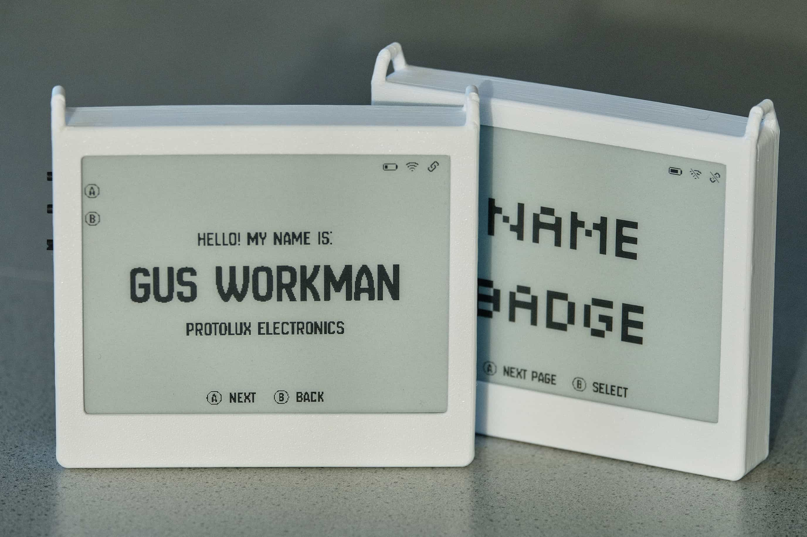
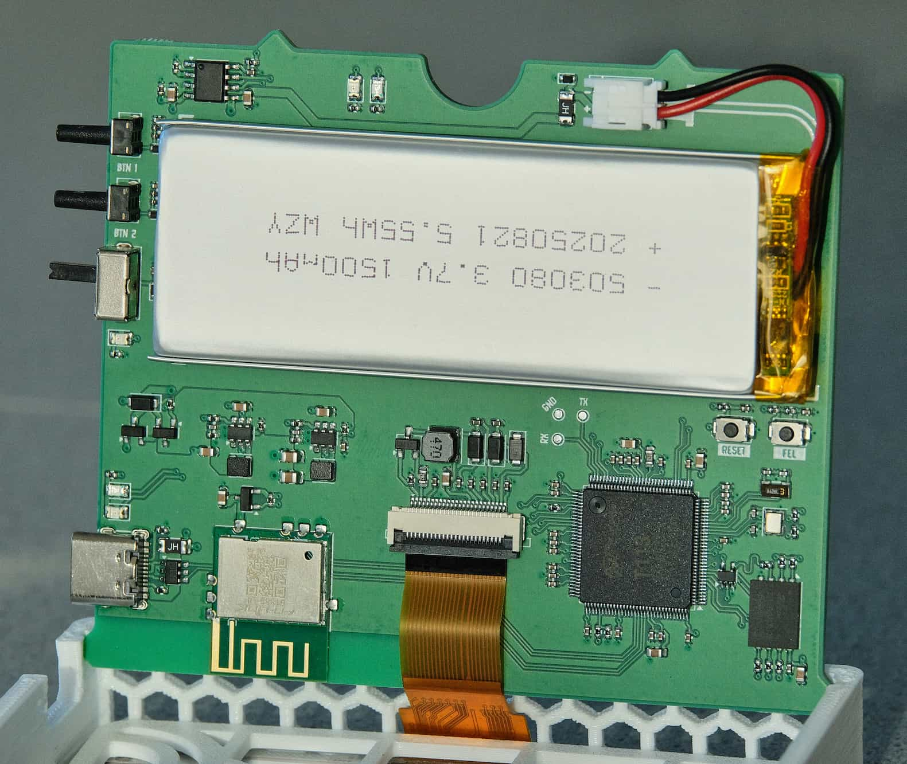
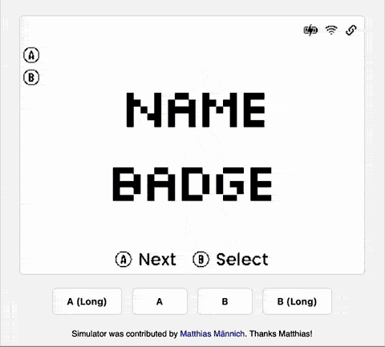

# Nerves Name Badge

This is the Nerves software for the Goatmire EU 2025 digital name badge.




My conference talk about the badges is available on YouTube:

[](https://youtu.be/VFmlNZ_BQHQ?si=QmM__-oR1jTcWF8w)

## Getting Started

If you already have a badge, you can get started by following these instructions
to load a firmware on your device. For those without the hardware, you can still
join in on the fun by using the simulator to create new screens. See more
information about the simulator below

### Uploading pre-built firmware

If you have a device, it should already have usable firmware on it. That means,
you should be able to connect to it via SSH over a USB connection.

To test if this is the case, do the following:

1. Plug a USB-C cable from your computer to the badge
2. Turn off the device via the slide switch
3. Ensure the red or green LED immediately to the left of the USB port is on
4. Turn on the device via the slide switch
5. Wait for the device to boot
6. On your machine, run `ssh wisteria.local`
   - The default SSH password is `nerves`
   - If you are having trouble connecting to the device, please check your
     network settings and verify that a USB Ethernet device is attached to your
     machine.
   - If the issue still persists, reboot the device

Once you are connected, you can upload the latest firmware `.fw` file from the
releases section of this page. To upload, run:

`cat path/to/release.fw | ssh -s wisteria.local fwup`

The device will automatically reboot after uploading the firmware file

## Advanced

The getting started guide above shows how to load pre-built firmware on the
device. For advanced topics, please see the guides below:

- [Flashing a firmware file via FEL](guides/flashing-via-fel.md)
- [Build custom firmware](guides/build-custom-firmware.md)
- [Create your first screen](guides/custom-screen.md)

Building firmware from source requires several dependencies:

### Install Erlang/Elixir

Recommended way to install Erlang/Elixir is with
[`mise`](https://mise.jdx.dev/getting-started.html). After installing `mise`,
install the required versions of Erlang and Elixir by running `mise install`.

### Install Nerves

Nerves is a framework for building embedded systems with Elixir. It provides a
set of tools and libraries to help you develop, build, and deploy your firmware.
To install Nerves, follow the instructions in the docs:

https://hexdocs.pm/nerves/installation.html

## Simulator

Thanks to Matthias Männich for contributing the simulator! Here's what it looks
like:



To run the simulator, use the following command:

```sh
MIX_TARGET=host iex -S mix
```

This will start a Phoenix LiveView on `localhost:4000`. It should automatically
open your browser page on launch.

> [!TIP]
> When changing code while using the simulator, you can type `recompile` at the
> IEx prompt. The running code will be updated (you may need to navigate to a
> different screen or refresh the browser page to see the changes).

> [!WARNING]
> If you build for the simulator, then build a firmware for your device, you may
> see an error message like the following:
>
> ```
> scrub-otp-release.sh: ERROR: Unexpected executable format for '/Users/gus/Projects/elixir/name_badge/_build/trellis_dev/_nerves-tmp/rootfs_overlay/srv/erlang/lib/typst-0.1.7/priv/native/libtypst_nif-v0.1.7-nif-2.15-x86_64-apple-darwin.so'
>
> Got:
>  file:Mach-O 64-bit dynamically linked shared library x86_64
>
> Expecting:
>  readelf:ARM;0x5000400, Version5 EABI, hard-float ABI
>
> This file was compiled for the host or a different target and probably
> will not work.
> ```
>
> To fix the error, run:
>
> ```sh
> mix deps.clean dither
> mix deps.clean typst 
> MIX_TARGET=trellis mix deps.get
> ```
>
> From here you can compile a firmware and upload as normal.

## Snake

The name badge runs snake! Here's a preview:


Thanks Peter Ullrich for the contribution!

## Calendar Sync (Google Calendar or any Calendar via iCal)

The badge can display your Google Calendar events on an e-ink screen with three
views: **Day**, **Week**, and **Month** (7x6 grid). Events are fetched from a
read-only iCal secret address.

### How to get your iCal URL in Google Calendar

1. Go to [Google Calendar](https://calendar.google.com) on your computer.
2. Click **Settings** (gear icon) > **Settings for my calendars**.
3. Select the calendar you want to sync.
4. Click **Integrate calendar**.
5. Copy the **Secret address in iCal format**.

> [!WARNING]
> This URL grants read-only access to your calendar. Treat it like a password
> and do not commit it to version control.

### Building firmware with Calendar support

Set the `CALENDAR_URL` environment variable before building the firmware:

```sh
CALENDAR_URL="https://calendar.google.com/calendar/ical/YOUR_SECRET_ADDRESS/basic.ics" \
  MIX_TARGET=trellis mix firmware
```

Or for the simulator:

```sh
CALENDAR_URL="https://calendar.google.com/calendar/ical/YOUR_SECRET_ADDRESS/basic.ics" \
  MIX_TARGET=host iex -S mix
```

You can also customize the refresh interval (default is 5 minutes / 300000 ms):

```sh
CALENDAR_URL="https://..." CALENDAR_REFRESH_INTERVAL="600000" MIX_TARGET=trellis mix firmware
```

### What happens if CALENDAR_URL is not set?

The calendar feature is **entirely disabled**. The "Calendar" option will not
appear in the main menu, the `CalendarService` process will not start, and the
badge will function normally without any calendar-related overhead.

### Screen controls

| Button | Action |
| ------ | ------ |
| A (single press) | Next day / week / month (depending on current view) |
| B (single press) | Previous day / week / month (depending on current view) |
| A (long press) | Cycle views: Day -> Week -> Month |
| B (long press) | Navigate back to main menu |

## Hardware Design

The repo for the hardware design can be found
[here](https://github.com/protolux-electronics/wisteria_hardware). This includes
schematics, layout and case design files.

The hardware was custom-made for Goatmire 2025, and there was only a limited
supply of devices. It is technically possible to build your own from the
resources in this repository. However, I do not recommend it as some of the
components (e-ink display, wifi module, etc) were custom ordered from the
manufacturer and will be difficult to obtain in low quantities.

I am working on a new revision of the hardware design with some nice upgrades -
a 5.8" display, low power mode, additional sensors, and more. It will hopefully
be available for purchase in early 2026. Stay tuned for updates!

## Use at Conferences and Events

If you have an interest in using these devices at a wide scale at an event,
please get in touch - I would consider producing more units or designing custom
versions of the hardware for the right event.

## Acknowledgments

Special thanks to Lars Wikman for encouraging this crazy idea at Goatmire 2025,
finding a sponsor to cover the cost of the hardware, brainstorming badge
features with me, and so much more.

Another huge shout out to Frank Hunleth, Benjamin Milde, and Flora and Tom
Petterson for helping me assemble the badges at midnight, less than 8 hours
before the Goatmire conference started.

## Protolux Electronics

This is a project by [Protolux Electronics](https://protolux.io), the small
Nerves-focused consultancy that I run. We do custom hardware and software for
IoT, industrial automation, and more. If you have a project in mind, let's get
in touch!
